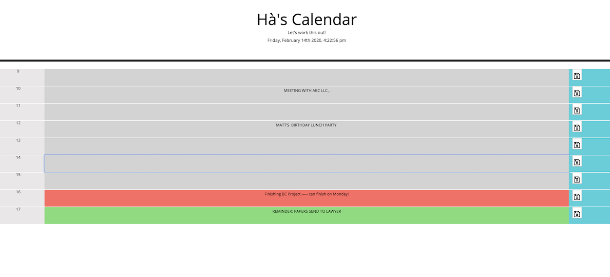

# About my-calendar:

This is a simple calendar I created for myself so that I could keep track of my schedule, meetings and event at work. My calendar represents my 9-5 working hour and it helps me to manage my time effectively.

## Layout of my-calendar:

---

## Description:

-   Create the layout of the calendar using Bootstrap template, assigning 3 value to the calendar: Time, Event and Save (for saving events). Using for loop for the Time.
-   Making the Save area clickable and savable with on.(click) and localStorage. Also use fontawesome for the save icon.
-   Making the Event area writeable and savable with localStorage.
-   Adding current time, using Moment.js.
-   Adding color coded for different time block of past, present, and future.

## Link to my-calendar: 

https://github.com/iamha1/my-calendar
----

## Reference: 
- Bootstrap: https://getbootstrap.com/
- Moment Js: https://momentjs.com/
- Stackoverflow: https://stackoverflow.com/
- W3 School: https://www.w3schools.com/default.asp
- Font Aweseme: https://fontawesome.com/start

`